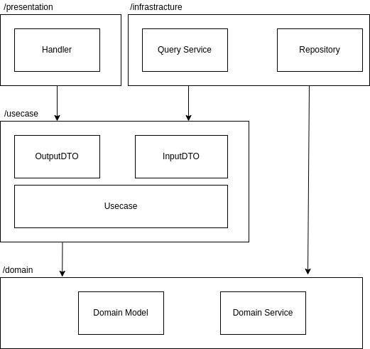

# email-news
指定されたメールアドレスに重要なニュース記事を送信するアプリ

## DFD(データフロー図)

## アーキテクチャ
ソフトウェアアーキテクチャとして、Clean Architectureを採用しています。実際のファイル構成と合わせると以下の通りになります。上から順番に、「Interface Adapter」、「Application Business Rule」、「Enterprise Business Rules」の層になっています。

